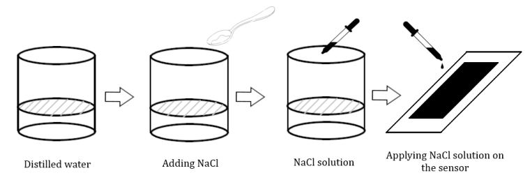

# 📄 Paper-Based Flexible Sensor for Wearable Applications

A low-cost, eco-friendly, and responsive **flex sensor** made using **graphite-coated filter paper** enhanced with **sodium chloride (NaCl)** — designed for wearable and assistive applications. This project demonstrates the **design, fabrication, and characterization** of a sustainable alternative to conventional silicon-based flex sensors.

## 📌 Key Features

- 🔋 **Power-efficient** and responsive sensor for real-time bending detection  
- 🌿 **Eco-friendly materials**: graphite, filter paper, NaCl  
- 💸 **Ultra-low cost** fabrication (~INR 10)  
- 🔧 Easily integrable with **Arduino (ATmega328P)**  
- 🎮 Ideal for gesture-based control, assistive devices, and wearable electronics  

---

## 🧪 Sensor Construction

### Materials Used:
- Grade A Filter Paper  
- 10B Graphite Pencil  
- NaCl solution (1g/5ml in distilled water)  
- Copper tape, X-ray plate (as flexible backing)  
- Transparent protective sheet  
- Arduino UNO (ATmega328P) for data acquisition  

### Dimensions:
- **Optimal sensor size**: `6 cm × 1 cm`  
- Varying lengths and widths were tested for sensitivity and stability

---

## 🛠️ Fabrication Steps

1. **Outline** the sensor on filter paper (6×1 cm)
2. **Fill** with graphite for conductivity
3. **Apply NaCl solution** to enhance ionic conductivity
4. **Dry** overnight and attach copper tape + backing
5. **Solder** wires and add protective layer
6. **Interface** with Arduino using a voltage divider (R1 = 1Ω)

---

## 📈 Data Acquisition

- Uses Arduino’s **10-bit ADC**
- Real-time monitoring via Serial Monitor & Plotter
- Voltage output calculated by:
```cpp
  Voltage = (ADC_Value × 5) / 1023
```
- Output varies with bending due to resistance changes in sensor

---

## 📊 Performance Summary

| Parameter        | Paper Sensor | Commercial Sensor |
|------------------|--------------|-------------------|
| Sensitivity (Up) | 0.0022       | 0.0007            |
| Sensitivity (Down) | 0.0012     | 0.0009            |
| Peak Voltage     | ~5.0V        | ~4.97V            |
| Repeatability    | High         | Medium            |
| Durability       | Excellent    | Moderate          |

- Shows **higher sensitivity** at small angles  
- Excellent **repeatability and durability** over 20+ cycles  
- Sustainable alternative for budget-constrained environments

---

## 🚀 Applications

- 🤖 **Assistive Glove**: For individuals with motor impairments  
- 🎮 **Gesture-Based Gaming**: Affordable, sensitive input control  
- 🦾 **Robotics**: Real-time bending angle detection  
- 🧥 **Smart Textiles**: Integration into wearables and health monitors  

---

## 📷 Visual Overview

| Fabrication Steps | Final Setup |
|------------------|-------------|
|  |  |  


---

## 🧠 Future Improvements

- Use of **CNC plotters** for consistent graphite application  
- Integration with **wireless modules** for IoT-based wearables  
- Advanced **machine learning models** for gesture interpretation  

---

## 📚 Citation

If you use this project or build upon it, please cite:


